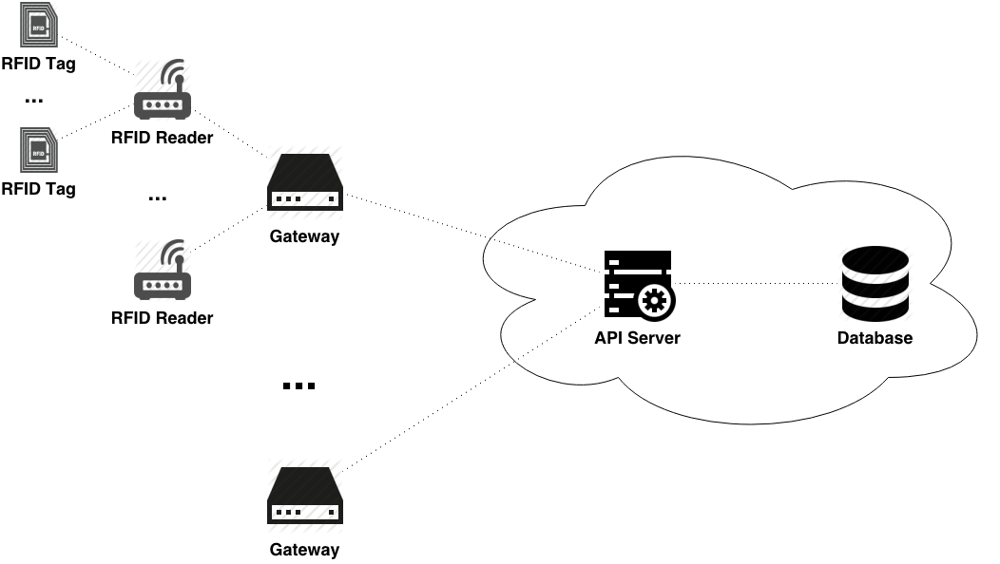

# RFID-based Asset Tracking with Node.js and MongoDB

As the title states, we are going to discuss how to build an
[RFID](http://en.wikipedia.org/wiki/Radio-frequency_identification)-based asset
tracking system using popular open source tools like
[Node.js](http://nodejs.org/) and [MongoDB](http://www.mongodb.org/). For the
sake of simplicity, let's start with a very basic model of a system addressing
only a general concern of getting some information from RFID hardware and
putting it in the database. Of course, in real life we would have to think
about many details and additional components to take into account security,
bandwidth consumption, monitoring, etc., but let us forget about it all for now
and get back to these aspects in our future posts.

## Overall Architecture

Let's take a look at some basic components our RFID asset tracking system needs.

### RFID Tags

RFID tags are compact devices which in our context are physically attached to
the asset being tracked. These tags can be active (containing a power source
and periodically emitting their ID as a signal), passive (no power source) or
semi-passive (have a power source to power internal circuits but use the power
from the reader to transmit). Within the scope of this post, the type we are
using doesn't really matter since any tag type can provide us with some kind of
a tag ID.

### RFID Readers

RFID readers are the devices that receive information regarding the positions
of RFID tags and transmit it upstream. The type of readers and the way they
receive data strongly depends on the type of the tags being used. Once again,
let's not focus on the particular hardware so far as we will get back to it
later.

### Gateways

A gateway is a hub connecting RFID readers with remote modules. It can be a
physical device located on the same premises the readers are located on, as
well as a remote and / or virtual container. The main purpose of a gateway is
gathering messages coming from the readers (or sensors, etc.) and transmitting
them to the system backend. Depending on the environment and the complexity of
the data, some sort of buffering, caching and pre-processing can also be
required to be performed on the gateway.

If you are asking yourself whether or not you need some special equipment for
an RFID gateway, the answer really depends on the scale and the environment of
your project, but in most relatively simple cases a
[Raspberry Pi](http://en.wikipedia.org/wiki/Raspberry_Pi) or a
[Beaglebone Black](http://en.wikipedia.org/wiki/BeagleBone_Black#BeagleBone_Black)
can easily do the job for you.

### API Server

In our case,
[API](http://en.wikipedia.org/wiki/Application_programming_interface)
server is a bridge between the gateways and the database. This server
translates the messages from end devices to the database objects. To a certain
extent, you could say that it defines what part of your database you want to
expose and how you would prefer to do it.

There is a lot of ways to design such a server, but if we are talking about
some standards, then
[REST](http://en.wikipedia.org/wiki/Representational_state_transfer) is,
obviously, one of the most advanced and popular. Among other things, it defines
a set of actions (e.g. CREATE, READ, UPDATE or DELETE) that can be performed
over resources (corresponding to the database collections which are the NoSQL
equivalents of tables in
[RDBMS](http://en.wikipedia.org/wiki/Relational_database_management_system)
and match those actions with the HTTP methods (e.g. POST, GET, PUT or DELETE).

Of course, using HTTP and a RESTful API server is only one of many possible
approaches, but it can easily give you the idea on how such a system could work
in general.

### Database

The database, basically, is the place where your RFID data should ultimately
land up. At this point it should already be transformed to match the object
model of your system, and once the data is received you can easily track the
changes through your frontend (e.g. Web, iOS or Android application).

## Software Choices

As we agreed earlier, here we are describing a very basic use case of an RFID
system without getting in the details. So, you could be curious then, why we
are so definitive about Node.js and MongoDB? Let's see some reasoning.

### Node.js and Related Frameworks

Obviously, there is a lot of programming environments which could be used in
order to implement the solution in question. Node.js and its various frameworks
have some important features that could provide considerable help during the
implementation, including:

- speed: Node.js' V8 engine is much faster than most of the popular languages
used for Web development (see
https://www.paypal-engineering.com/2013/11/22/node-js-at-paypal/,
http://www.appdynamics.com/blog/nodejs/an-example-of-how-node-js-is-faster-than-php/
and http://inkstonehq.com/2013/07/10/node-js-vs-rails-which-is-better/ for some
benchmarks);
- scalability: a single Node.js process is able to handle thousands of
concurrent connections with minimal overhead;
- language: JavaScript is extremely popular programming language, which
simplifies the task of finding developers for the project; moreover, using
JavaScript on both the server and the browser improves communication between
system components and offers some opportunities to reuse the server code on
the client and vice versa, especially, in case of
[isomorphic frameworks](http://venturebeat.com/2013/11/08/the-future-of-web-apps-is-ready-isomorphic-javascript/);
- community: Node.js has one of the most strong and active communities
nowadays, which makes the processes of code maintenance, debugging and
refactoring many times easier and faster;
- industry support: [a lot of companies](http://nodejs.org/industry/) from
startups to big corporations successfully use Node.js in production;
- libraries: more then 70000 different packages are currently accessible via
Node Packaged Modules, [npm](https://npmjs.org/), and the total number of
packages grows on a faster pace then, for example, even the number of
[Ruby gems](http://rubygems.org/stats), that have been around much longer.

However, only in very rare cases it makes sense to use pure language
implementation for a new Web project, since most of the time some popular
features are already implemented with some frameworks. In our case, the
following frameworks constitute considerable interest:

- [Express.js](http://expressjs.com/) is a server-side web-application
framework for Node.js, but a very minimalistic one, which means it provides
only some basic functionality, no hidden magic or anything like that. However,
Express.js has quickly became a standard in Node.js based Web-development and
a base not only for so called
[MEAN-stack](http://blog.mongodb.org/post/49262866911/the-mean-stack-mongodb-expressjs-angularjs-and)
(MongoDB-Express.js-Angular.js-Node.js), but also for a lot of higher level
frameworks;
- [Sails.js](http://sailsjs.org/) is one of most popular frameworks (obviously,
Ruby on Rails-inspired) using Express.js as a foundation. Some of its key
features that can help us to implement our solution include:
  * automatic RESTful API generation;
  * built-in database-agnostic
  [ORM](http://en.wikipedia.org/wiki/Object-relational_mapping);
  * real-time features support with built-in [Socket.io](http://socket.io/)
  engine.

### MongoDB

Currently, [MongoDB](http://www.mongodb.org/) is probably most popular of the
[NoSQL](http://en.wikipedia.org/wiki/NoSQL) database engines. And this is for
a reason: it has so many great qualities enhancing previously traditional
relational database experience. Namely, for our project the following features
are of special interest:

- flexibility: storing data in JSON ([BSON](http://en.wikipedia.org/wiki/BSON))
documents, MongoDB is not bounded by such a serious relational database
limitation as fixed schema and doesn't need the data to be normalized; for us,
it means that we can easily store different class of assets with different
specifications and uniquely structured embedded data for every document;
- functionality: MongoDB provides most of the traditional RDBMS features
including indexes, dynamic queries, sorting, updates, upserts (update if
  document exists, insert if it doesn’t), etc., adding on top of it all the
  capacities offered by non-relational model;
- speed: keeping related data embedded in documents, we can query results much
faster than in case of relational databases where we usually need to join
multiple tables in order to achieve similar results;
- scalability: scaling the database becomes really easy with MongoDB's
[autosharding](http://docs.mongodb.org/manual/sharding/), and that can be
really helpful in case of our task, when the number of assets being tracked
can grow significantly;
- simplicity: easy to install, configure, support, and use, MongoDB works right
out of the box, without any excessive configuration or fine-tuning.

These features make MongoDB a perfect candidate for the role of the system's
main database engine.

## Implementation

The basic idea is simple: your gateway is receiving some data from the
peripherals (RFID readers in our case) and makes appropriate HTTP-calls to the
API server. The latter accepts the information, processes it and updates the
database accordingly. Now, let's see how to do it in practice.

### Prerequisites

Obviously, in order to run the following examples, you have to install some
software first.

#### Node.js

Download the latest stable Node.js package for your operating system from
http://nodejs.org/ or install it via a package manager:
https://github.com/joyent/node/wiki/Installing-Node.js-via-package-manager.
Alternatively, you can use your own build of the desired version, see
https://github.com/joyent/node/wiki/Installation for details.

#### MongoDB

You can download MongoDB binaries from http://www.mongodb.org/downloads, then
follow one of the installation guides corresponding to your operating system:
http://docs.mongodb.org/manual/installation/. Note, that unless you are using a
packaged version, the server doesn't start automatically, so you would need to
start it manually as described here:
http://docs.mongodb.org/manual/tutorial/manage-mongodb-processes/.

#### npm

Good news is that npm comes with Node nowadays, so, in general, you don't have
to install anything else. Typing npm in the command line should give you a list
of available commands (if it doesn't, you can find a bunch of other ways to
install npm here: https://www.npmjs.org/doc/README.html#Fancy-Install-Unix or
https://www.npmjs.org/doc/README.html#Fancy-Windows-Install).

#### Sails.js

As simple as `npm install sails@0.9.13 -g` (you may need to prefix it with
`sudo` though, depending on your operating system and user privileges).

### Data Structure

Keeping it simple, let's define 4 collections that will represent our system's
entities:

- tags, RFID tags containing:
  * tag — tag unique identifier (independent from the database, not the
  database object ID), which can come as an EPC or in any other form allowing
  to differ a tag unambiguously,
- readers, RFID reader objects:
  * reader — reader unique identifier, in any form the gateway is sending it,
- assets, objects corresponding to the assets we are tracking:
  * name — asset name / title,
  * tagID — the database object ID (reference) of the tag assigned to this
  asset,
  * currentReaderID — the database object ID (reference) of the reader where
  this asset was seen last time,
  * note, that here we can also have some custom fields that differ from one
  asset to another (given the fact that we are using a NoSQL solution, it comes
  at no cost), since the assets themselves can have completely different nature,
- events, containing messages being received from gateways and meaning, in
general, that "this tag was seen near this reader":
  * tag —  tag identifier,
  * reader —  reader identifier,
  * rssi —
  [RSSI](http://en.wikipedia.org/wiki/Received_signal_strength_indication), an
  optional field which may or may not be presented depending on your RFID
  hardware.

Let's see how we can create an API server for these models and get it running
in 5 minutes. Literally.

### RESTful API with Sails.js

A lot of arguments are being conducted on whether it makes sense to extend
standard Express' functionality to sort of match higher level Web frameworks
or Express itself with its middleware ecosystem already contains everything
needed to build a Web application from scratch. The answer, most probably,
depends on the project you are developing, but one of the things about
Sails.js that looks really impressive is the RESTful API it automatically
generates. Indeed, you may not even have to write a single line of code.

Let's start by creating a new Sails.js application (Note: the following
examples use v0.9.13 of Sails.js, which was the last stable version of the
framework as of this writing):

    sails new rfid-based-asset-tracking-with-nodejs-and-mongodb

will create a subfolder named
`rfid-based-asset-tracking-with-nodejs-and-mongodb` (or you could use any other
name) within your current location and generate base boilerplate code
necessary to run the simplest Sails application. Now, in order to create a
complete API for the previously described data structure, let's switch to this
new folder and type the following:

    sails g tags
    sails g readers
    sails g assets
    sails g events

These commands will generate models and controllers for corresponding entities,
so `ls ./api/controllers/` will give you

    AssetsController.js  EventsController.js  ReadersController.js TagsController.js

and `ls ./api/models/` will display

    Assets.js  Events.js  Readers.js Tags.js

At this point we don't even care about the code in these files (there's not a
lot of it anyway). All we need to see our API server in action is to start the
Sails.js application, but first let's make sure it will connect to our MongoDB
database.

### Connecting to MongoDB

By default, Sails.js comes with a proprietary database adapter called
`sails-disk`, which is a simple disk-based storage engine that can be used for
development purposes, but not suitable for production (mainly, performance and
scalability wise). Let's switch it to Mongo.

Open `./config/local.js` and add the following code right after
`module.exports = {`:

    adapters: {
      default: 'mongo',

      // MongoDB
      mongo: {
        module : 'sails-mongo',
        host : 'localhost',
        port : 27017,
        // user : 'username', // Authentication is supposed to be disabled by default,
        // password : 'password', // if it's not, put the username / password here
        database : 'rfid' // Or any other name you want
      },
    },

Since Sails requires a separate module to connect to Mongo, we have to install
it:

    npm install --save sails-mongo

Once again, before you proceed, make sure your MongoDB server is running.

### Processing the Data

Let's start our server:

    sails lift

By default, Sails application will be listening on port 1337, so if you open
`http://localhost:1337/` in your browser, you should get a nice default page
(which is useless for us though). Note, that your server must be running during
the further experiments.

If you open `http://localhost:1337/tags/` now, you will see [], which is a JSON
form of an empty array. This simply means we don't have any objects in tags
collection of our database. Let's create some.

By default, with Sails.js you not only can use a standard RESTful mapping of
HTTP methods to CRUD action (e.g. POST to CREATE an object), but you also have
so called
[developer shortcuts](https://github.com/balderdashy/sails-docs/blob/master/config.controllers.md#shortcuts-boolean)
that let you use simple HTTP GET requests for all the actions. So, creating new
tags is as simple as opening the following links in your browser:

    http://localhost:1337/tags/create/?tag=tag1
    http://localhost:1337/tags/create/?tag=tag2
    http://localhost:1337/tags/create/?tag=tag3

Now, if you go back to `http://localhost:1337/tags/`, you should see something
like this:

    [
      {
        "tag": "tag1",
        "createdAt": "2014-03-25T15:40:54.995Z",
        "updatedAt": "2014-03-25T15:40:54.995Z",
        "id": "5331a38683d14dd59d527277"
      },
      {
        "tag": "tag2",
        "createdAt": "2014-03-25T15:41:14.645Z",
        "updatedAt": "2014-03-25T15:41:14.645Z",
        "id": "5331a39a83d14dd59d527278"
      },
      {
        "tag": "tag3",
        "createdAt": "2014-03-25T15:41:18.731Z",
        "updatedAt": "2014-03-25T15:41:18.731Z",
        "id": "5331a39e83d14dd59d527279"
      }
    ]

Thus, we created three objects that correspond to our RFID tags. Note, that we
only needed to provide an identifier to each tag and Sails.js automatically
made sure the objects receive additional fields, such as `id` corresponding to
the MongoDB `_id` and `createdAt` / `updatedAt` timestamps, similar to the ones
Rails provides with its
[Active Record](http://guides.rubyonrails.org/active_record_querying.html).
Let's create other objects we need in the same manner:

    http://localhost:1337/readers/create/?reader=reader1
    http://localhost:1337/readers/create/?reader=reader2
    http://localhost:1337/readers/create?reader=reader3
    http://localhost:1337/assets/create?name=asset1
    http://localhost:1337/assets/create?name=asset2
    http://localhost:1337/assets/create?name=asset3

After that, visiting `http://localhost:1337/readers/` and
`http://localhost:1337/assets/` will give you something like

    [
      {
        "reader": "reader1",
        "createdAt": "2014-03-25T16:35:13.776Z",
        "updatedAt": "2014-03-25T16:35:13.776Z",
        "id": "5331b04183d14dd59d52727a"
      },
      {
        "reader": "reader2",
        "createdAt": "2014-03-25T16:35:24.761Z",
        "updatedAt": "2014-03-25T16:35:24.761Z",
        "id": "5331b04c83d14dd59d52727b"
      },
      {
        "reader": "reader3",
        "createdAt": "2014-03-25T16:35:38.987Z",
        "updatedAt": "2014-03-25T16:35:38.987Z",
        "id": "5331b05a83d14dd59d52727c"
      }
    ]

and

    [
      {
        "name": "asset1",
        "createdAt": "2014-03-25T16:36:44.136Z",
        "updatedAt": "2014-03-25T16:36:44.136Z",
        "id": "5331b09c83d14dd59d52727d"
      },
      {
        "name": "asset2",
        "createdAt": "2014-03-25T16:36:48.303Z",
        "updatedAt": "2014-03-25T16:36:48.303Z",
        "id": "5331b0a083d14dd59d52727e"
      },
      {
        "name": "asset3",
        "createdAt": "2014-03-25T16:36:59.127Z",
        "updatedAt": "2014-03-25T16:36:59.127Z",
        "id": "5331b0ab83d14dd59d52727f"
      }
    ]

respectively.

Now we have to link our assets and our tags (which corresponds to attaching
tags to the physical objects). We will use the tagID property of asset
objects in order to establish such a link. This operation, once again, can be
performed directly in browser, but since MongoDB generates unique object IDs
[in a way randomly](http://docs.mongodb.org/manual/reference/object-id/#ObjectIDs-BSONObjectIDSpecification),
we can only provide here a template, and you will have to construct your own
URLs:

    http://localhost:1337/assets/update/<id-of-the-asset-object>/?tagID=<id-of-the-tag-object>

For example, in our case we got the following URLs:

    http://localhost:1337/assets/update/5331b09c83d14dd59d52727d/?tagID=5331a38683d14dd59d527277
    http://localhost:1337/assets/update/5331b0a083d14dd59d52727e/?tagID=5331a39a83d14dd59d527278
    http://localhost:1337/assets/update/5331b0ab83d14dd59d52727f/?tagID=5331a39e83d14dd59d527279

Technically, after that  we can already make some API calls to notify our
server on the current position (the closest reader) of our assets. The URL
template would be

    http://localhost:1337/assets/update/<id-of-the-asset-object>/?currentReaderID=<id-of-the-tag-object>

But there is a couple of problems with this approach. First, the ID of the tag
object in this URL is supposed to be the database object ID, which the gateway
shouldn't be aware of as we would prefer to keep our peripherals relatively
independent from the central server and the database. Second, going this way we
will not have any historical information about our assets' locations. That's
where we going to need the last class of objects we described in our data
structure, events.

The idea is pretty simple: instead of updating the location of the asset
directly, we are going to create an event each time a new location comes from a
gateway. For example:

    http://localhost:1337/events/create/?tag=tag1&reader=reader1&rssi=128

This will let our server (and the database) know that the tag with the
identifier "tag1" was seen near the RFID reader identified as "reader1" and the
signal strength was 128 (on a scale from 0 to 255).

Perfect. However, it would be much more convenient for us to minimize the
number of associations needed whenever we are querying the database trying to
get the current location of an asset. Namely, using the `currentReaderID`
property of an asset object we could organize our assets collection in an
easily queryable way. Here is, probably, the only place (apart from the config
file) where you will have to write some code.

In order to achieve our goal, we are going to use a feature of Sails.js'
[ORM](http://en.wikipedia.org/wiki/Object-relational_mapping)
[Waterline](https://github.com/balderdashy/waterline) called lifecycle
callbacks (similar to
[Rails Active Record callbacks](http://edgeguides.rubyonrails.org/active_record_callbacks.html)),
specifically, beforeCreate event. The code we will write goes to
`./api/models/Events.js`:

    module.exports = {
      attributes: {
        /* e.g.
          nickname: 'string'
        */
      },

      // Lifecycle Callbacks
      beforeCreate: function(values, next) {
        Tags.findOne({'tag': values['tag'].toString()}, function(err, tag) {
          if (err)
            return next(err);
          if (!tag)
            return next(new Error("No tags with the following parameters were found: {'tag': " + values['tag'] + "}"));
          Assets.findOne({'tagID': tag.id}, function(err, asset) {
            if (err)
              return next(err);
            if (!asset)
              return next(new Error("No assets assigned to the following tag were found: {'tag': " + values['tag'] + "}"));
            Readers.findOne({'reader': values['reader'].toString()}, function(err, reader) {
              if (err)
                return next(err);
              if (!reader)
                return next(new Error("No readers with the following parameters were found: {'reader': " + values['reader'] + "}"));
              if (asset.currentReaderId === reader.id)
                next();
              else {
                asset.currentReaderId = reader.id;
                asset.save(function(err) {
                  if (err)
                    return next(err);
                  next();
                });
              }
            });
          });
        });
      }
    };

Here is what this code essentially does:

- beforeCreate event fires every time a new event object is being created
(obviously, before creation);
- the handler function receives the values of the event properties;
- it finds the tag object corresponding to the identifier sent by the gateway;
- it finds the asset to which the found tag is attached;
- it finds the reader object corresponding to the identifier sent by the
gateway;
- it checks whether the asset changed its location, and if it did, the handler
set the currentReaderID property of the asset to the new value (object ID of
  the reader it just found);
- finally the handler function calls next() callback to get back to the event
loop.

Restart your Sails.js application (stop with Ctrl+C and start with
`sails lift`).

Now, whenever a gateway is sending new data with

    http://localhost:1337/events/create/?tag=<tag-identifier>&reader=<reader-identifier>&rssi=<rssi-value>,

not only corresponding event object (a history log entry) will be saved to the
database, but also the currentReaderID property of the tagged asset will be
changed accordingly. You can easily do some tests and check the changes via
API: `http://localhost:1337/assets` and `http://localhost:1337/readers`.

### Getting Even More

So, with only about 50 lines of code we got ourselves an API server that logs
movements of our assets and can provide us with up-to-date information on the
current location of any of these assets. What could be better? Maybe, the fact
that we are actually getting even more with Node.js / Sails.js and MongoDB.
These "freebees" include:

- though it's very simple, our architecture can easily be scaled horizontally,
since the components are relatively independent from each other and we can
have, for example, multiple API servers behind a load balancer or use
replication and sharding functionalities MongoDB provides out of the box;
- one of the main features of Sails.js is Socket.io support built in, so you
can have a real-time frontend to your RFID system with minimum effort;
- since MongoDB is a schemaless database (or, as they officially say nowadays,
"database with dynamic / flexible schema"), we can store with our assets and
have ready to be displayed any related information without worrying too much
about relational structures, normalization, etc., for example, we can fetch
some parameters from our ERP system, store within our Mongo document and
display within our asset monitoring frontend;
- and so on.

## What's next?

Thus, we designed a way our RFID gateways can report the events to the central
database. Of course, it is a very simplistic model leaving aside a lot of
important aspects (the biggest of which is, probably, security), but it would
be somewhat unreasonable to try to cover too many topics within one article,
so we will be moving gradually.

And the next thing we will look at within our series is the architecture of a
simple RFID gateway, its software (and how to write it in Node.js, of course)
and connecting RFID peripherals.

## License

[The MIT License](http://opensource.org/licenses/MIT)

Copyright (c) 2014 [Innobec Technologies Inc.](http://www.innobec.com/)
